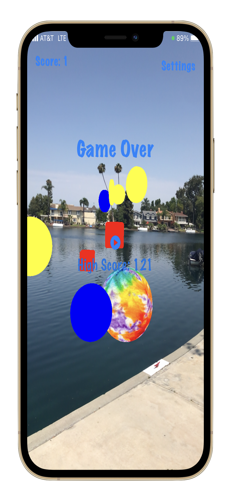

<!DOCTYPE html>
<html lang="en" dir="ltr">

<head>
  <meta charset="utf-8">
  <title>Ethan's Game's Website</title>
  <link href="https://cdn.jsdelivr.net/npm/bootstrap@5.0.2/dist/css/bootstrap.min.css" rel="stylesheet" integrity="sha384-EVSTQN3/azprG1Anm3QDgpJLIm9Nao0Yz1ztcQTwFspd3yD65VohhpuuCOmLASjC" crossorigin="anonymous">
  <link rel="stylesheet" href="styles.css">
  
  
  
  
</head>

<body>
  <section class="title">
    

      <nav class="navbar navbar-expand-lg navbar-dark">
        <a class="navbar-brand" href="">Ethan's Game's Website</a>
        <button class="navbar-toggler" type="button" data-bs-toggle="collapse" data-bs-target="#navbarTogglerDemo02" aria-controls="navbarTogglerDemo02" aria-expanded="false" aria-label="Toggle navigation">
          
        </button>
        

          <ul class="navbar-nav ms-auto">
        

      </nav>
      

        

          <h1>The coolest augmented reality game since the last one you played!</h1>
        

        

          
          
      

    

  </section>

  <section class="app-info">
    <h1 class="HowToPlay">How To Play</h1>
    <h3 class="disclaimer">This game requires at least an Iphone 7 or later. Apple's ARKit only runs on A10 chips or better.</h3>
    

      

        <h3>Area</h3>
        
Make sure you have some space for the best experience possible.

      

      

        <h3>Placement</h3>
        
Hold your device upright and forward, like you're taking a picture.

      

      

        <h3>Start</h3>
        
Press Start and collect coins while trying to dodge the red blocks.

      

    

    

      <h3 class="help">If the game is not working properly, try closing the app then re-opening it. If that has not solved the issue, send an <a href="contact.html">email</a>.</h3>
    

  </section>

  <section class="reviews">
    <h1 class="reviewsTitle">See what others think about the game!</h1>
    

      

        

          <h2>"A game everyone can enjoy."</h2>
          <em>-Zach</em>
        

        

          <h2>"This game is out of this world!"</h2>
          <em>-Tony</em>
        

        

          <h2>"I can't stop playing!"</h2>
          <em>-Dani</em>
        

      

      <a class="carousel-control-prev" href="#testimonial-carousel" role="button" data-slide="prev">
        
      </a>
      <a class="carousel-control-next" href="#testimonial-carousel" role="button" data-slide="next">
        
      </a>
    

  </section>

  <section class="index">
    

    

    <h4 class="ending">A project founded and developed by Ethan. Made with much love and many more tears.</h4>
  </section>

</body>

</html>
